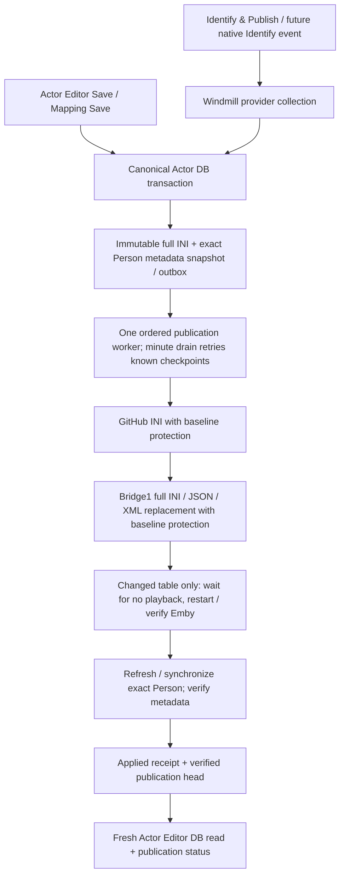
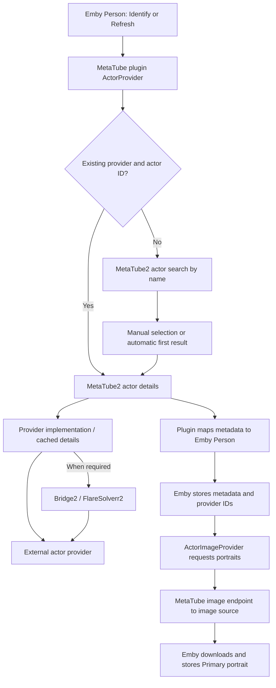
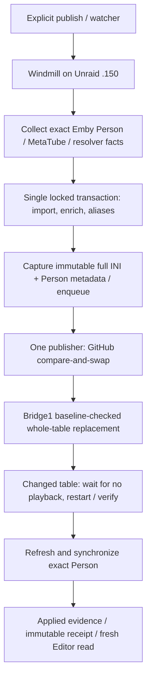

# Actor scraping, enrichment, publication, and Emby delivery

Updated 2026-09-30 UTC. Read with the [stack and host map](METATUBE_STACK_ARCHITECTURE.md).

The [actor mapping contract](ACTOR_METADATA_MAPPING.md) defines the next
field-level enrichment work: eight-source identity/ID discovery, protected
merging, structured overview and JAVDB-only source counts. Its dictionary and
fixture are a specification, not evidence that those adapters are deployed.

## Current unified publication path

This supersedes the historical audit/checkpoints below. The canonical database
is `jav_actor_db` on Kraken, not the MetaTube cache or Windmill's internal DB.
JAV Master 2.1.76 has automatic publication enabled. Backend enrichment,
idempotent replay, real Editor overview/mapping forward-and-restore tests and
future-only watcher cutover have passed. Exact evidence is tracked in the
[release regression record](ACTOR_PUBLICATION_REGRESSION_20260930.md).

MetaTube2 release `2026.09.30.2` additionally mirrors these durable publication
receipts into LOGS-METATUBE-ACTOR, grouped with collector lookups by request/run
ID. Japanese-only native Identify now reaches the guarded enrichment producer.
See [Romanized identity and unified trace acceptance](ACTOR_TRACE_UNIFIED_WORKFLOW.md)
for the live 今井美優 canary, review evidence and correlation limitations.



Save does not itself mean Applied. Publication is asynchronous; pending,
blocked and failed states remain visible. Reviewed actor-editor fields/aliases
and seven installed review holds survive enrichment. Uncertain external writes
block for reconciliation rather than blind resend. Metadata-only Saves reuse a
verified unchanged table without restarting Emby. Historical native Identify
events are held; no broad inventory refresh, People cleanup or identity merging
is part of single-actor publication. Ordinary plugin lookup remains separate.

## Historical pre-outbox continuation — 2026-09-30 UTC

The controlled real enrichment/publication canary now passes. Earlier sections
describe the original read-only audit; this checkpoint supersedes its statement
that no live publication/restart had been tested.

- Mai Takeda (`42935ba3-42ae-41ae-b2ea-e4771437a013`, Emby Person `7759`)
  traversed enrichment → canonical `jav_actor_db` → complete INI → GitHub →
  bridge1 replacement → Emby application restart → exact Person refresh/sync.
- Job `01a0efdc-5163-f06b-088a-fae670221364` finished all 11 stages successfully
  at `2026-09-30T01:11:46Z` in 118.158 seconds. DB revision is 56. Final name is
  `Mai Takeda (JAP、1998、竹田まい)`, birthday `1998-05-12`; four post-refresh name
  checks passed without corrective rewrites. Actor Editor fresh search showed
  the same 12 provider mappings (plus separate inventory groups marked review).
- 5,791 effective mappings match GitHub INI, installed INI and MetaTube JSON/XML
  table bytes: SHA-256 `507268bcb9cb289d8bb1f340c524d9189cfdb240ecc56796e1a37829fa32ffa3`.
  Live publisher resource still targets `kinlshum/windmill-project`, artifact
  commit `6975bedb861a5f8a13d31b9e743b55d858e7acac`; this legacy destination is
  not yet migrated to the canonical actor repository.
- Six user-approved conflicting inventory mappings retain installed names.
  A seventh existing plugin-only mapping (`川口ともか`) is also preserved, with
  a separate review finding. Holds are not proof of identity correctness.
- First real canary `01a0efd3-6c9f-3eba-83b7-e86619175a7c` failed closed before
  publication because a bulk inventory sync introduced unrelated changes.
  Only that sync was restored from backup under an exact-state transaction
  guard (4,239 rows); Mai enrichment and all holds were retained. Single-actor
  publication now skips bulk inventory unless `sync_inventory=true` explicitly.
- Repaired stale Windmill Emby authentication using the established integration
  secret; restored missing bridge publication routes. No secret is in Git.
  Emby's legacy plugin Configuration API fails for this SimpleUI plugin. The
  canary verifies disk hashes, observed application downtime/readiness after
  authenticated restart, plugin availability, and exact Person readback. It
  does **not** claim direct readback of the plugin's in-memory table.
- Backups and machine-readable acceptance are private on Kraken under
  `/mnt/cache_nvme_apps/appdata/actor-unification-20260929-holds/`.
- JAV Master review-only release 2.1.74 (`7c4852864e23`) subsequently passed
  health/auth checks. All seven held groups expose `needs_review` and their
  publication-hold note. Independent browser search verified Tomoka's installed
  mapping and `# needs review: publication_hold`; the owned rollout pause was
  removed. This release did not change actor data or enable Save publication.

At that historical checkpoint, ordinary Editor Save was DB-only, not automatic publication;
native Identify watcher endpoint/backlog recovery is not enabled. Seven
historical queued watcher entries were not replayed. Next work needs a durable
Save outbox, immutable export snapshot, publication-only flow and truthful
pending/applied/retry UI. Manual alias export and delete/restore semantics must
be tested before enabling it. No People-folder cleanup or duplicate deletion
was performed. The newly scraped age-decorated alias `Mai Takeda/28岁` is source
data, not a canonical-name change or a claim that alias cleanup is complete.

**Two different flows exist:** ordinary Emby actor metadata/image lookup, and
database-backed **Identify & Publish**. The second includes canonical identity
maintenance, INI generation, whole-table delivery and Emby refresh. A successful
MetaTube lookup alone does not prove publication ran or Emby saved an image.

This replaces the obsolete description of DB-to-INI automation as unimplemented.
The automation exists in the Windmill repository. This review checked source,
live container placement, mounts and caller paths; it did **not** run a live
publication, restart Emby, change actors or verify every deployed script/DLL.

## 1. Normal Emby actor Identify / metadata refresh



- Emby is container `EmbyServer` on Kraken, service IP `192.168.10.151:8096`.
  Its dedicated MetaTube service is `192.168.10.167:8080`.
- Plugin source `ActorProvider.cs` searches when no usable provider identity
  exists; an existing identity can go straight to details. Search previews and
  applying the selected actor are separate requests.
- SDK endpoints: `/v1/actors/search` and `/v1/actors/{provider}/{id}`. Results can
  include aliases, birthday, measurements, nationality and image URLs. The
  plugin maps supported fields, not necessarily every returned field.
- `ActorImageProvider.cs` is separate: it needs a saved provider identity and
  offers **Primary** actor portraits. Preview images are not proof of a final
  Person image download.
- Direct HTTP, cache, provider adapters and browser-solver fallback are
  conditional paths, not a mandatory bridge/solver chain for every actor.
  Movie scan provider order is not an actor-provider order contract.
- SDK actor sources include AV-LEAGUE, Minnano-AV, XsList and GFriends. In
  `engine/actor.go`, all-provider actor search fans out concurrently to registered
  actor providers under their throttles, then sorts results by provider priority;
  it is not sequential first-match movie scanning. When enabled, database
  fallback can contribute cached results.
- Successful Japanese-provider actor details can additionally trigger
  **GFriends portrait injection**. A GFriends call alongside another selected
  actor provider is therefore expected, not necessarily an extra identity match.
- Custom resolver integration can additionally canonicalize names during
  movie/Person processing. Resolver cache/overrides are not the canonical Actor
  DB. Match the installed DLL/configuration to source before claiming exact
  deployed behavior.

## 2. What starts database enrichment and publication?

| Entry point | Behavior | Boundary |
| --- | --- | --- |
| Actor browser `:8093`, Identify & Publish | Explicitly submits a Windmill publication job | Pass the exact Emby Person ID. Distinct from ordinary metadata lookup. |
| Native Emby Identify + `jav-actor-identify-watcher` | Watches `RemoteSearch/Apply` log entries, resolves the Person and queues publication with durable pending/offset state | Best-effort log integration, not a native transactional webhook. Check actual submission and job ID. |
| Explicit Windmill invocation | Supplied identity, aliases, exact Person ID, request UUID and dry-run flag | Defaults `dry_run=true`; bulk inventory/consolidation is rejected by this flow. |
| JAV Master Actor Editor / INI mapping editor | Save to canonical DB and enqueue immutable publication in the same transaction when enabled | Check the receipt: Saved/pending is not Applied. Other consumers must explicitly use the same contract. |

### Verified routing drift

The **live** actor browser and watcher on 2026-09-29 still submit to workspace
`homelab`, flow **`f/jav_actor_db/publish_actor_substitutions`**:

```text
POST /api/w/homelab/jobs/run/f/f/jav_actor_db/publish_actor_substitutions
```

Canonical Windmill source lives at
**`f/jav_master_app/actor_db/publish_actor_substitutions.flow/flow.yaml`**.
The old eleven-stage live flow/new-path404 drift found on September29 was
corrected in the September30 rollout: both entrypoint names now resolve to
the same two-module atomic-producer/publication-worker flow. The minute drain
uses the same worker, not a competing publisher. The watcher endpoint correction
is a separately verified future-event cutover; seven historical events remain
held. Its active endpoint is now `.150:8001`; in-container existing-request
replay passed with zero new actor mutations. Completion and rollback state
are recorded in the release regression record.
The separate Emby Windmill UI/API on `:7810` has its own integration/workspace
and is not a required hop for actor-browser publication.

## 3. Full Identify & Publish sequence



All script names below are in `f/jav_master_app/actor_db`.

| Runtime stage | Responsibility and evidence |
| --- | --- |
| `enqueue_actor_enrichment` preparation | Exact Person import, MetaTube details and resolver collection occur before the transaction; no global inventory or duplicate consolidation. |
| Atomic apply + canonical `publication.snapshot` | Apply prepared facts using the three collector modules under writer lane1; preserve reviewed fields; capture full effective mapping and exact Person revisions/metadata; commit outbox with DB changes. Same request UUID returns its original receipt. |
| `publish_saved_actor_request` | Request-ID-only consumer. Verify predecessor and snapshot revisions, GitHub baseline/blob, then bridge file baseline. No re-scraping or importing manual edits. |
| Emby delivery inside worker | Changed INI requires playback-safe observed reload; unchanged verified table skips restart. Synchronize exact Person metadata while preserving unrelated IDs; verify stable readback. Uncertain writes fail closed. |
| `drain_actor_publications` | Minute schedule attempts oldest eligible request; waits for lease/backoff, stops behind failed/blocked requests, resumes known delivery checkpoints. |
| Publication receipt/head | Durable stage/error/evidence and applied snapshot hash; Editor fresh reads show canonical DB data plus request status. File delivery alone is not Applied. |

Legacy direct GitHub/bridge publisher scripts are retired on the live instance.
Inventory and duplicate-cleanup tools remain separate reviewed operations.

## 4. Database -> INI -> Actor substitution table

### Actor Editor unification checkpoint (2026-09-29)

JAV Master actor directory/record views previously used the actor copy in
`jav_master_db`, while INI mapping edits already used `jav_actor_db`. All 1,707
old actor UUIDs are in the canonical database (1,713 actors). Do not merge the
entire JAV Master database: the app candidate introduces actor-only
`ACTOR_DATABASE=jav_actor_db`, retaining global `PGDATABASE=jav_master_db`.

Backups, additive editor compatibility columns/tables, and **86 separate review
findings** are now present in canonical Actor DB. Identity, alias, mapping and
Emby-link hashes are unchanged. Uncertain names and seven legacy-only aliases
are review evidence, not guessed corrections or automatic alias imports.
The app candidate places `# needs review` above a group, never inside its name
or INI value, and preserves unsaved drafts during refresh.

JAV Master **2.1.72**, release commit `ca8413a`, is now live with scoped canonical
actor routing and review controls verified. External-writer revision guards are
deployed; installed definitions match the disposable-tested version and actor
data fingerprints remain unchanged. All 34 actor backend tests passed without
skips, alongside 11 browser tests. Save responses return final revisions after
alias writes; stale drafts are rejected and unsaved edits survive refresh.
At the 2.1.72 checkpoint, saving was not automatic publication. The September30
outbox rollout now implements publication-only delivery of Editor Saves; it
does not call Identify/enrichment again or overwrite manual corrections.
See the current regression record for final deployed acceptance.

Implementation, backup hashes and acceptance status live in the
[Actor DB unification handoff](https://github.com/kinlshum/homelab_jav-actor-db/blob/codex/actor-unification-review/docs/ACTOR_UNIFICATION_20260929.md).

### Target publication contract

**Edit authoritative Actor DB -> publish -> render full export -> GitHub artifact
-> bridge -> replace entire Emby MetaTube table -> reload / refresh / verify.**
This is not append-only upload.

Bridge targets under Kraken's existing EmbyServer tree:

```text
/mnt/cache_nvme_apps/appdata/EmbyServer/
  metadata/temp/JAV-ACTOR-SUB.ini
  plugins/configurations/MetaTube.json
  plugins/configurations/MetaTube.xml
```

The publication bridge is maintained in Actor DB's
`ops/homelab-identity/metatube_provider_bridge.py`. It validates the hash,
backs up existing files, updates active INI/configuration representations and
reports verification. Per-file writes and a process-local lock are **not** one
distributed transaction across DB, GitHub and Emby. Exception rollback is
limited to available backups; inspect individual targets after failure.

```text
EnableActorSubstitution = true
ActorRawSubstitutionTable = complete generated INI text
```

Movie actor-list substitution uses case-insensitive exact alias matching before
canonical resolution/Person creation. Replacing the table does not rewrite all
existing Emby People/movies retroactively; wider cleanup is a separate job.

**Suppression caveat:** the plugin supports `alias=` to omit an actor, but the
current Windmill renderer rejects empty canonical targets and its preview omits
blank mappings. Do not claim legacy suppressions survive automatic export.
Reconcile suppression policy and test case-insensitive alias collisions before
relying on full replacement of a table containing exclusions.

**Shared writer caveat:** bridge1 and bridge2 have separate state directories,
but both live containers mount these same Emby configuration directories.
Separate lookup stacks do not isolate actor-table writers. Serialize publication
for this Emby target; do not run competing bridge jobs.

## 5. Data stores and end-state verification

| Store | Owns | Does not prove |
| --- | --- | --- |
| Actor PostgreSQL 17, Kraken `:5433` | Canonical actors, aliases, profiles/evidence, export views and publication telemetry | Emby loaded the table or downloaded a portrait. |
| MetaTube1/2 PostgreSQL 15 | Separate SDK/provider caches | Canonical actor editorial authority or workflow history. |
| Windmill PostgreSQL 16, Unraid `:5434` | Jobs, steps and workflow state | Correct final Emby Person data. |
| Resolver cache/overrides, Kraken `:9211` | Resolution and configured overrides | Automatic synchronization of every canonical DB edit. |
| Emby data and people folders | Saved Person/movie relationships and portraits | Complete actor-source enrichment in Actor DB. |
| Generated INI / GitHub revision | Published mapping snapshot | Plugin in-memory application or completed refresh. |

For one actor, check Windmill step results, DB identity, export hash/revision,
bridge per-target hashes, live plugin configuration result, readiness/restart
outcome, exact Person's final name/aliases/provider IDs and retrievable portrait.

The deploy script can return bridge `verified=true` after an Emby Configuration
API HTTP failure, with `live_config_verified=false`. That is **not** fully
verified plugin runtime state. File hashes, HTTP readiness and correct final
Person data are distinct checkpoints.

Keep the current **legacy flat** EmbyServer people layout. No nested migration,
filesystem deletion, direct Emby DB rewrite or global cleanup is included here.

## 6. Where to inspect failures

- **Emby:** plugin metadata/image logs plus exact Person ID. Separate search,
  selected-result application, refresh and image download.
- **MetaTube2 Admin:** actor lookup traces and individual provider errors;
  successful fallback need not mean every provider succeeded.
- **Watcher/browser:** Identify detection, pending state, submission errors and
  returned Windmill job ID.
- **Windmill `homelab`:** complete job/step outputs for publication, reload,
  refresh and final sync. Ordinary Emby lookup may have no Windmill job.
- **Bridge/resolver:** per-target hash errors and source/cache decisions.
  FlareSolverr is relevant only when a request uses it.
- **Graylog1 .155:** application GELF and container context. Graylog2 .153 is
  system/syslog. Uncorrelated service lines are context, not actor-run evidence.

Admin1's `2026.09.28.1` contextual actor-log slice was deployed on 2026-09-29.
This does not mean Admin2 has the same release or all components share one
durable trace. See [deployment log](DEPLOYMENT_LOG.md).
No end-to-end publication was executed for this documentation review.

## 7. Canonical sources

- [Windmill flow/scripts](https://github.com/kinlshum/homelab_windmill/tree/main/f/jav_master_app/actor_db): orchestration/export/publication. Reviewed local source at `65bbf14`; live old-path flow has 11 stages, new path absent, full script equivalence remains unchecked.
- [Actor DB repository](https://github.com/kinlshum/homelab_jav-actor-db): canonical schema, actor data and operations. Historical docs may retain old hosts/namespaces.
- [Identify watcher](https://github.com/kinlshum/homelab_jav-actor-db/blob/main/ops/actor-identify-watcher/watcher.py): native Identify integration and old-path caller.
- [Publication bridge](https://github.com/kinlshum/homelab_jav-actor-db/blob/main/ops/homelab-identity/metatube_provider_bridge.py): INI/config delivery, distinct from the SDK generic bridge source.
- [Plugin repository](https://github.com/kinlshum/homelab_jellyfin-plugin-metatube): ActorProvider, ActorImageProvider, MovieProvider, configuration and substitution parser; match source to installed DLL before claiming deployed equivalence.
- This SDK repository owns actor APIs/providers, Admin and this stack map.
  `metatube-work/` snapshots and legacy hand-push scripts are historical
  references, not the canonical DB-driven publication source.
