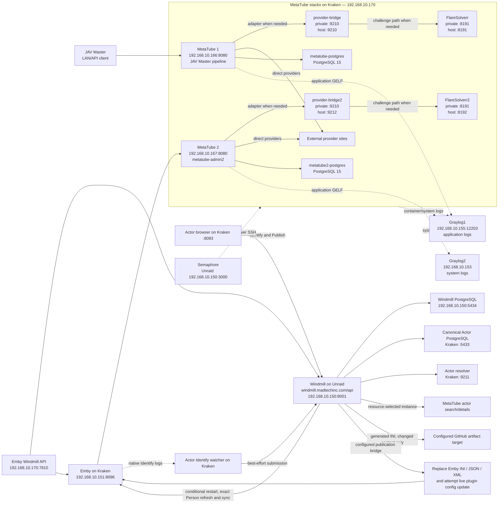

# MetaTube stack architecture and placement

Updated 2026-09-29 from read-only Kraken/Unraid container inventory, service IPs,
mounts and source review. This maps MetaTube plus the actor scraping,
publication and Emby delivery stack; it is not a second Compose file or proof
that every workflow completed successfully.

For the actor database, substitution-table, and Emby delivery path, see
[`ACTOR_IDENTITY_SUBSTITUTION_FLOW.md`](ACTOR_IDENTITY_SUBSTITUTION_FLOW.md).

## Deployment drawing

## Hosts and responsibilities

| Host | Role | Relevant locations/endpoints |
| --- | --- | --- |
| `192.168.10.170` (`Kraken`) | Docker host for MetaTube, actor-side services, and Emby Windmill app | MetaTube Compose: `/mnt/cache_nvme_apps/appdata/metatube-stack`; Emby Windmill API is `:7810` |
| `192.168.10.150` (`Unraid`) | Windmill and Semaphore host | Windmill container `windmill-1` serves `:8001`; Windmill PostgreSQL serves `:5434`; Semaphore UI `:3000` runs guarded MetaTube deployment tasks against Kraken |
| `192.168.10.151` | Emby **container service IP on Kraken**, not a separate physical host | `http://192.168.10.151:8096`; plugin metadata traffic uses MetaTube2 |
| `192.168.10.155` (`graylog1`) | Application-log Graylog LXC/service | `https://graylog1.madtechinc.com`; MetaTube GELF input `:12203`; search API `:9000` |
| `192.168.10.153` (`graylog2`) | System/syslog Graylog LXC/service | `https://graylog2.madtechinc.com`; do not use this endpoint for MetaTube application GELF |

## Docker services on Kraken

| Service/container | Function | Persistent data or isolation |
| --- | --- | --- |
| `metatube` | MetaTube1 API for JAV Master | LAN `192.168.10.166:8080`; config/trace volume `/mnt/cache_nvme_apps/appdata/metatube-server-charleshuang233:/config`; uses `metatube-postgres`, `provider-bridge`, and `metatube-flaresolverr` |
| `metatube-postgres` | MetaTube1 PostgreSQL 15 | `/mnt/user/appdata/metatube/postgres` |
| `metatube-provider-bridge` | Provider adapter, MDC-NG access, actor substitution state | diagnostic host port `9210`; state `./provider-bridge/state`; uses `flaresolverr:8191` |
| `metatube-flaresolverr` | Browser challenge solver for MetaTube1/JAV Master | diagnostic host port `8191`; never share its state with MetaTube2 |
| `metatube2` | Dedicated Emby-only MetaTube API | LAN `192.168.10.167:8080`; public admin `https://metatube-admin2.madtechinc.com/admin`; config/trace volume `/mnt/cache_nvme_apps/appdata/metatube2-server:/config`; uses the `*2` dependencies |
| `metatube2-postgres` | MetaTube2 PostgreSQL 15 | `/mnt/user/appdata/metatube2/postgres` |
| `metatube2-provider-bridge` | Separate provider adapter/state for Emby lookups | diagnostic host port `9212`; state `./provider-bridge2/state`; uses `flaresolverr2:8191`; actor publication mounts still target the same Emby as bridge1 |
| `metatube2-flaresolverr` | Isolated browser solver for Emby | diagnostic host port `8192` (container port `8191`) |
| `emby-windmill-api` / `emby-windmill-app` | Thin Emby/Windmill orchestration API and UI | host port `192.168.10.170:7810`; uses `WINDMILL_URL=http://windmill.madtechinc.com/api` and the `admins` workspace |
| `EmbyServer` | Person/movie metadata, installed MetaTube/custom plugins, portrait storage | host appdata `/mnt/cache_nvme_apps/appdata/EmbyServer` mounted at `/config`; service IP `.151`; retain legacy flat people layout |
| `jav-actor-browser` | Actor DB operator UI and explicit Identify & Publish submission | host network, listens on `:8093`; `/mnt/user/appdata/jav-actor-browser` mounted at `/app` |
| `jav-actor-identify-watcher` | Best-effort bridge from native Emby Identify log events to Windmill | Reads Emby logs/data; durable state `/mnt/disk17/appdata/jav-actor-identify-watcher/state`; actor workspace `homelab` |
| `jav-actor-db-postgres` | **Canonical Actor DB**, PostgreSQL 17 | host `:5433`; identities, aliases, profiles, export views and workflow telemetry; separate from SDK cache databases |
| `jav-actor-resolver` | Canonical-name resolution, source lookup, cache/overrides | host `:9211`; supporting service, not authoritative publication DB |
| `jav-actor-vault` | Actor data administration UI | host `:3088` to container `:3000`; not a required scrape hop |
| `jav-actor-coverage` | Actor coverage/reconciliation support | Background support, not a mandatory synchronous Identify stage |

### Lookup isolation versus publication sharing

Both bridges have separate `/state` mounts, but live inspection confirms both
mount the same Emby `metadata/temp` and `plugins/configurations` directories.
They can therefore write the **same** active actor substitution table. Their
separate lookup state does not provide a cross-process publication lock.
Serialize publication per Emby target. No filesystem migration is implied.

### Windmill PostgreSQL note

The live Windmill container runs on Unraid with PostgreSQL at
`192.168.10.150:5434` (credentials are intentionally not documented). The two
MetaTube PostgreSQL containers are separate databases and must not be reused by
Windmill.

## Request and logging paths

1. JAV Master calls MetaTube1 at `192.168.10.166:8080`.
2. Emby calls MetaTube2 at `192.168.10.167:8080`.
3. Each instance uses its corresponding adapter/solver when needed; other
   providers use direct HTTP or cached data. FlareSolverr is not involved in
   every scrape. Preserve the separate lookup dependencies.
4. Windmill's API is `http://windmill.madtechinc.com/api`, hosted on Unraid
   `.150:8001`. Actor publication uses workspace `homelab`; the separate
   Emby Windmill app integration uses `admins`. Avoid appending `/api` twice
   when a caller expects a base URL rather than an API URL.
5. Actor publication enriches the canonical Actor DB, generates the full INI,
   versions changed content, delivers it via the resource-selected bridge,
   then reloads/refreshes/synchronizes Emby. Ordinary actor lookup does not
   inherently execute this workflow. See the [detailed 12-stage flow](ACTOR_IDENTITY_SUBSTITUTION_FLOW.md).
6. Structured application traces and provider events are sent to Graylog1
   (`192.168.10.155:12203`). Container/system collection is separate from the
   application GELF stream, and Graylog2 is reserved for system/syslog.

## Change-control rules

- Update `deployment/compose.yaml` and this document together when a service,
  port, volume, or dependency changes.
- Never use Windmill as a provider URL. Windmill orchestrates; MetaTube executes
  provider calls directly or through its adapters/solver.
- Keep MetaTube1 and MetaTube2 PostgreSQL, bridge state, FlareSolverr sessions,
  and trace volumes separate.
- Do not commit `.env` files, Windmill tokens, Emby keys, provider cookies, or
  database passwords.
- After deployment, verify both `/v1/providers` endpoints, both admin pages,
  bridge health, FlareSolverr health, Windmill `/api`, and the Graylog1 GELF
  input before declaring the stack healthy.

## Verification boundaries and known drift

- 2026-09-29: Kraken container names, bridge/solver/DB published ports, Emby and
  MetaTube service IPs, shared publication mounts, browser port and browser/
  watcher submission paths checked read-only. Unraid `windmill-1`,
  `windmill-postgresql16` and Semaphore placement rechecked. The separate
  finance-reconciliation Windmill stack is not the actor workflow host.
- Live actor browser/watcher still call `f/jav_actor_db/publish_actor_substitutions`;
  canonical Windmill source now lives under `f/jav_master_app/actor_db`.
  Read-only API check on Unraid `.150:8001` found old-path flow HTTP 200 with
  11 stages, new-path HTTP 404. Watcher still targets `.170:8001` (connection
  refused), with seven jobs pending and held from replay. Full deployed script
  equivalence is not verified; do not reconnect/replay without a reviewed plan.
- Actor Editor unification is in progress: canonical `jav_actor_db` now has
  editor compatibility schema and 86 separate review findings; actor identities
  and mappings are unchanged. The actor-only app routing/review UI and revision
  guards are still deployment gates. Save-to-DB must not be shown as applied to
  Emby. See [current flow checkpoint](ACTOR_IDENTITY_SUBSTITUTION_FLOW.md#actor-editor-unification-checkpoint-2026-09-29).
- Admin1 is release `2026.09.28.1`, commit `0d322bc`, deployed 2026-09-29.
  Admin2 was intentionally unchanged by that deployment. Do not infer matching
  releases from matching admin branding. See [deployment evidence](DEPLOYMENT_LOG.md).
- Repository Compose now points MetaTube2 at the canonical repository; the
  live Admin2 build context was still the old repository name at the last
  deployment inspection. Correct it through a scoped future deployment.
- Graylog host roles and persistent DB paths retain the earlier documented
  configuration; no end-to-end actor publication or full log-delivery test was
  executed during this documentation-only review.
